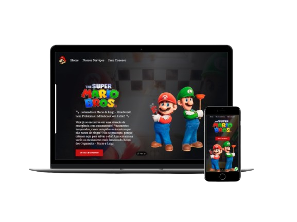

<h1 align="center">
    
    
Pagina web de serviços com o tema Mario e Luígi

</h1>

## Descrição:

Projeto construído com habilidades adquiridas no curso DevClub. Aqui, aplicamos os conhecimentos de desenvolvimento web para criar uma página esteticamente agradável e totalmente responsiva.

## Tecnologias utilizadas:

 
  
   
    

 

### Links do projeto:
[Visite o site aqui!](https://mario-opal.vercel.app/)

[Repositório](https://github.com/cri-suh/Meu-Portifolio)
